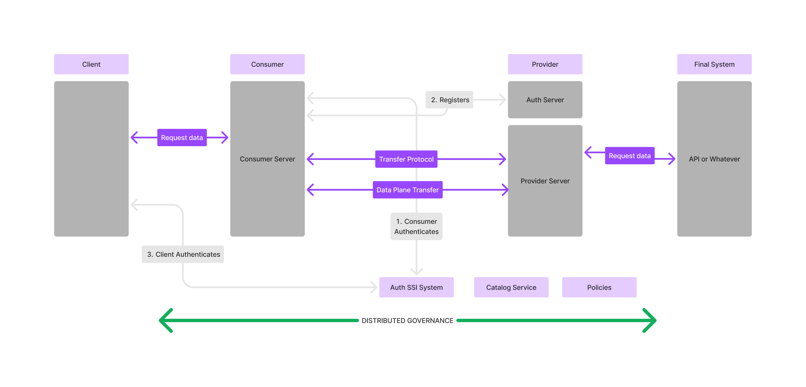

# Rainbow 🌈🌈<br>Dataspace Protocol Agent


## What is Rainbow

Rainbow is a **Dataspace Agent** implementation. 

This implementation has been made by the **GING** (Next Generation Internet Group) research group, part of the DIT (Department of Telematics Engineering) at the Universidad Politécnica de Madrid.

### Key Concepts

Rainbow is designed with a **multi-protocol orientation** and a **dynamic stack architecture**, enabling flexible integration across different dataspace ecosystems. It provides a complete end-to-end solution covering:

- 🔐 **SSI Authentication** — Self-Sovereign Identity based authentication using verifiable credentials and decentralized identifiers
- 📚 **Catalog Management** — DCAT3-compatible catalog system for dataset and data service discovery
- 🔗 **Datahub Proxy** — Integration layer for external data hubs and repositories
- 📝 **Contract Negotiation** — Full implementation of the Dataspace Protocol's contract negotiation flow
- 🚀 **Data Transfer** — Control plane and data plane for secure, policy-compliant data transfers

### What are Dataspaces?

Dataspaces are services that allow the sharing of data, or the subscription to data services between entities in an interoperable way and with a decentralized identity. Data spaces need different building blocks for their development, ranging from self-sovereign identity systems, through transfer negotiation protocols, contracts, catalogs, through policy enforcement systems. All this in order to generate the digital trust and security necessary for data sharing and to generate value and a real data economy.

For more information, we recommend reading the [Technical Convergence of Dataspaces](https://data-spaces-business-alliance.eu/wp-content/uploads/dlm_uploads/Data-Spaces-Business-Alliance-Technical-Convergence-V2.pdf).

### Feature Highlights

- **Rust Native** — Written in Rust from scratch, asynchronously based on Tokio runtime
- **HTTP APIs** — Built with Axum, SeaORM, and PostgreSQL
- **gRPC Support** — Protocol buffer definitions for inter-service communication
- **OpenAPI Integration** — Automatic API documentation with Utoipa-axum
- **Elegant Error Handling** — Using thiserror and anyhow for robust error management
- **Low Footprint** — Blazingly fast with minimal memory consumption

---

## Crate Organization

Rainbow is organized as a Rust workspace with multiple specialized crates:

### Core Crates

| Crate | Description |
|-------|-------------|
| **rainbow-core** | Main binary that orchestrates and runs the entire agent |
| **rainbow-common** | Shared library with common functionality, types, and utilities |
| **rainbow-db** | Database layer with SeaORM entities, migrations, and repositories |
| **rainbow-events** | Event system for inter-module communication |

### Protocol Crates

| Crate | Description |
|-------|-------------|
| **rainbow-catalog** | DCAT3-compatible catalog system implementing the Catalog Protocol |
| **rainbow-contracts** | Contract negotiation protocol implementation (ODRL policies) |
| **rainbow-transfer** | Transfer Process Protocol implementation for control plane |
| **rainbow-transfer-agent** | Agent layer for transfer orchestration with gRPC support |
| **rainbow-dataplane** | Data plane implementations (HTTP, NGSI-LD, future: DeltaSharing, Arrow Flight) |

### Gateway & Integration Crates

| Crate | Description |
|-------|-------------|
| **rainbow-auth** | SSI-based authentication layer with wallet and credential management |
| **rainbow-authority** | Authority services for trust and credential verification |
| **rainbow-fe-gateway** | Frontend gateway for UI integration |
| **rainbow-business-gateway** | Business logic gateway for external integrations |
| **rainbow-datahub-catalog** | Proxy layer for external datahub catalog synchronization |

---

## Getting Started

### Requirements

- **Docker** and **docker-compose** (or Docker Desktop)
- Permissions to execute scripts (`chmod +x`)

### External Dependencies

This project depends on [walt.id](https://walt.id) for the SSI authentication layer. You must download and deploy the walt.id identity services:

```bash
# Clone the walt.id identity repository
git clone https://github.com/walt-id/waltid-identity.git && cd waltid-identity

# Deploy all services with docker compose
cd docker-compose && docker compose up
```

### Quick Start

1. **Grant execution permissions** to the scripts (if needed):
   ```bash
   chmod +x scripts/bash/*.sh
   ```

2. **Prepare the environment** (executes initial configurations):
   ```bash
   ./scripts/bash/auto-setup.sh
   ```

3. **Start the services**:
   ```bash
   ./scripts/bash/auto-start.sh
   ```

4. **Run automatic onboarding** to authenticate actors:
   ```bash
   ./scripts/bash/auto-onboarding.sh
   ```

5. **Stop the services** when done:
   ```bash
   ./scripts/bash/auto-stop.sh
   ```

### Docker (Standalone)

You can also run Rainbow directly with Docker:

```bash
# Pull the image
docker pull caparicioesd/rainbow

# Start a provider instance
docker run caparicioesd/rainbow:latest provider start

# View available options
docker run caparicioesd/rainbow:latest provider -h
```

### Docker Compose

For more automated deployments, see `/deployment/docker-compose.testing.yaml` for a complete example with databases and migrations.

---

## Testing the Complete Flow

A Jupyter notebook is available to test the complete dataspace workflow interactively.

### Setup

```bash
# Create and activate virtual environment
python -m venv .venv
source ./.venv/bin/activate

# Install dependencies
pip install -r requirements.txt
```

### Workflow Overview

The notebook covers the following flow:

1. **Wallet Setup** — Initialize SSI wallets for participants
2. **Participant Onboarding** — Register provider and consumer identities
3. **Catalog Management** — Create catalogs, datasets, data-services, and distributions
4. **Policy Definition** — Define access policies for datasets
5. **Contract Negotiation** — Complete negotiation flow:
   - Request → Offer → Request → Offer → Acceptance → Agreement → Verification → Finalization
6. **Transfer Negotiation** — Data transfer flow:
   - Request → Start → Data access via dataplane
   - Suspension/Resumption → Completion

### API Endpoints Overview

| Category | Endpoints |
|----------|-----------|
| **Mates** | `/api/v1/mates/myself`, `/api/v1/mates/all` |
| **Catalogs** | `/api/v1/catalogs`, `/api/v1/catalogs/{id}/datasets`, `/api/v1/catalogs/{id}/data-services` |
| **Policies** | `/api/v1/datasets/{id}/policies` |
| **Negotiations** | `/api/v1/negotiations/rpc/setup-*` (request, offer, acceptance, agreement, verification, finalization) |
| **Transfers** | `/api/v1/transfers/rpc/setup-*` (request, start, suspension, completion) |
| **Dataplane** | `/api/v1/dataplane/{transfer_id}` |

---

## Architecture



- **Client** — Any client (machine or human) connecting to a consumer to access the dataspace via the high-level Consumer API
- **Consumer ↔ Provider** — Communication via the low-level API, an improved implementation of the Dataspace Protocol
- **Final System** — The backend environment where the provider's data is exposed

---

## Development and Contribution

1. Create a branch for your change:
   ```bash
   git checkout -b feature/my-change
   ```

2. Make clear and descriptive commits

3. Open a pull request against `main`

---

## License

See [LICENSE.md](./LICENSE.md) for details.
