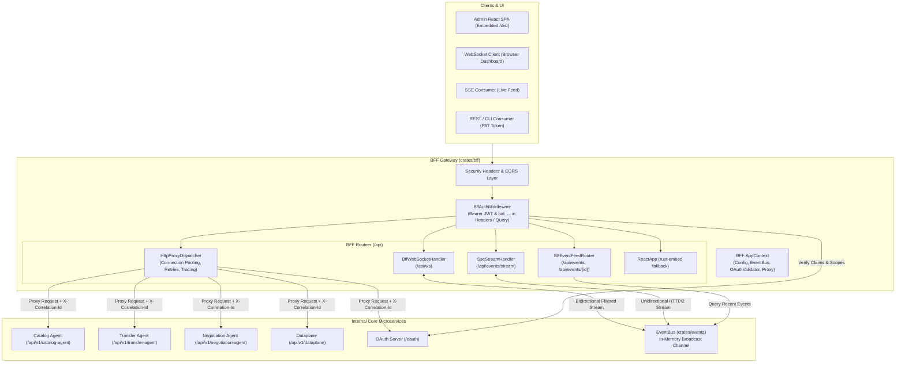

# Backend-For-Frontend & API Gateway (`bff`)

[](https://www.gnu.org/licenses/gpl-3.0)
[](https://www.rust-lang.org/)
[](#architecture-overview)

The **`bff`** (Backend-For-Frontend) crate serves as the enterprise API Gateway and frontend host for the DS-Protocol Dataspace Agent.

It embeds the React Admin SPA and unifies microservice reverse-proxying, real-time event streaming via **WebSockets** and **Server-Sent Events (SSE)** through [`events`](../events), perimeter authentication and role-based access control via [`oauth`](../oauth), and enterprise-grade resilience and distributed tracing.

---

## Table of Contents

- [Architecture Overview](#architecture-overview)
- [Key Enterprise Capabilities](#key-enterprise-capabilities)
- [Module Structure](#module-structure)
- [Events Integration (`events`)](#events-integration-events)
  - [1. Real-Time WebSocket Streaming with Topic Filters](#1-real-time-websocket-streaming-with-topic-filters)
  - [2. Server-Sent Events (SSE) Stream](#2-server-sent-events-sse-stream)
  - [3. Event Audit & Activity Feed](#3-event-audit--activity-feed)
- [OAuth & Security Integration (`oauth`)](#oauth--security-integration-oauth)
  - [Perimeter Authentication Middleware](#perimeter-authentication-middleware)
  - [Security Headers Injection](#security-headers-injection)
  - [User & Role Propagation](#user--role-propagation)
- [Reverse Proxy & Routing](#reverse-proxy--routing)
  - [Upstream Routing Table](#upstream-routing-table)
  - [Distributed Tracing & Correlation](#distributed-tracing--correlation)
- [Setup & Module Composition](#setup--module-composition)
- [Testing Guide](#testing-guide)

---

## Architecture Overview

The BFF Gateway sits between clients (browsers, admin SPAs, external automation tools) and internal microservices:



---

## Key Enterprise Capabilities

1. **Integrated Pub/Sub Streaming**: Consumes domain events directly from [`EventBus`](../events) with zero-copy in-process broadcast, streaming them to WebSockets or SSE clients with dynamic topic pattern filtering.
2. **Perimeter OAuth & PAT Security**: Uses `OauthTokenValidator` to enforce JWT and Personal Access Token (`pat_...`) authentication at the gateway perimeter before forwarding upstream.
3. **High-Throughput Connection Pooling**: Tuned `reqwest::Client` with TCP keep-alive (60s), idle connection harvesting (90s), and configurable connection limits per upstream host.
4. **Distributed Context Propagation**: Generates or propagates `X-Correlation-Id`, `X-Request-Id`, `X-Forwarded-*`, `X-User-Id`, and `X-User-Role` headers to all downstream microservices.
5. **Hardened Security Headers**: Injects `X-Content-Type-Options: nosniff`, `X-Frame-Options: SAMEORIGIN`, `X-XSS-Protection: 1; mode=block`, and `Referrer-Policy` on all gateway responses.
6. **Embedded Static Distribution**: Automatically packages and serves the React dashboard SPA via `rust-embed` with MIME-type resolution and single-page application (SPA) routing fallback.

---

## Module Structure

```text
crates/bff/
├── src/
│   ├── auth/                    # OAuth token extraction, validation & security headers
│   │   └── mod.rs               # BffAuthMiddleware
│   ├── events/                  # Real-time event streaming and UI audit feed
│   │   ├── feed_router.rs       # REST endpoints for event history (/api/events)
│   │   ├── sse_handler.rs       # Server-Sent Events stream (/api/events/stream)
│   │   ├── ws_handler.rs        # WebSocket 2.0 handler with dynamic TopicPattern filters
│   │   └── mod.rs
│   ├── gateway/                 # Legacy compatibility & main HTTP router
│   │   ├── router.rs            # GatewayHttpRouter aggregating proxy, events & static
│   │   ├── service.rs           # GatewayService wrapping HttpProxyDispatcher
│   │   └── mod.rs
│   ├── proxy/                   # Enterprise reverse proxy engine
│   │   ├── dispatcher.rs        # HttpProxyDispatcher (connection pool, tracing, forwarding)
│   │   └── mod.rs
│   ├── setup/                   # Composition matching transfer-agent-ref
│   │   ├── composition.rs       # BffModule implementing ServiceModuleTrait
│   │   ├── context.rs           # AppContext (config, event_bus, oauth_validator, proxy)
│   │   ├── http_worker.rs       # HTTP server worker & backward-compatible router factories
│   │   └── mod.rs
│   ├── static/                  # Embedded React Admin frontend
│   │   └── admin/dist/
│   ├── lib.rs
│   └── main.rs
└── tests/
    └── bff_tests.rs             # E2E integration test suite
```

---

## Events Integration (`events`)

### 1. Real-Time WebSocket Streaming with Topic Filters

Connected clients on `/api/ws` can subscribe dynamically to specific topics or wildcards:

#### Inbound Client Commands (JSON)
```json
// Subscribe to specific wildcard topic pattern
{ "action": "subscribe", "topic": "transfer.**" }

// Unsubscribe from a pattern
{ "action": "unsubscribe", "topic": "catalog.**" }

// Keepalive ping
{ "action": "ping" }
```

#### Outbound Server Notifications
```json
// Confirmed subscription
{ "type": "subscribed", "topic": "transfer.**" }

// Domain event delivery (EventEnvelope)
{
  "type": "event",
  "data": {
    "id": "urn:uuid:8f1704e6-d996-48c2-a9b0-97b5f1f7281c",
    "topic": "transfer.process.started",
    "source_crate": "transfer-agent",
    "schema_version": 1,
    "timestamp": "2026-09-06T10:30:00Z",
    "payload": {
      "process_id": "tp-001",
      "agreement_id": "agr-123"
    }
  }
}
```

### 2. Server-Sent Events (SSE) Stream

For dashboards requiring lightweight, one-way event streaming:

```http
GET /api/events/stream?topic=transfer.** HTTP/1.1
Host: localhost:8080
Authorization: Bearer <token>
Accept: text/event-stream
```

Streams standard SSE event frames:
```text
event: transfer.process.started
data: {"id":"urn:uuid:...","topic":"transfer.process.started","payload":{...}}

: keep-alive
```

### 3. Event Audit & Activity Feed

UI dashboards can query the persisted event store:
- `GET /api/events?topic=transfer.**&limit=50&offset=0`: List historical events.
- `GET /api/events/{id}`: Fetch detailed event metadata and payload by URN.

---

## OAuth & Security Integration (`oauth`)

### Perimeter Authentication Middleware

The `BffAuthMiddleware` supports dual token extraction:
1. **HTTP Authorization Header**: `Authorization: Bearer <jwt_or_pat>`
2. **URL Query Parameter**: `?token=<jwt_or_pat>` or `?access_token=<jwt_or_pat>` (essential for browser WebSockets and EventSource SSE connections).

### Security Headers Injection

Every response routed through the gateway receives enterprise security headers:
- `X-Content-Type-Options: nosniff`
- `X-Frame-Options: SAMEORIGIN`
- `X-XSS-Protection: 1; mode=block`
- `Referrer-Policy: strict-origin-when-cross-origin`

### User & Role Propagation

When an incoming request is authenticated, decoded claims are automatically injected as headers to downstream microservices:
- `X-User-Id: <sub_uuid>`
- `X-User-Role: admin | owner | reader`
- `X-Correlation-Id: <urn_or_uuid>`
- `X-Request-Id: <uuid_v4>`

---

## Reverse Proxy & Routing

### Upstream Routing Table

The `HttpProxyDispatcher` routes requests dynamically according to `GatewayConfig`:

| Path Prefix | Target Microservice | Destination Route |
|---|---|---|
| `/api/catalogs` | Catalog Agent | `/api/v1/catalog-agent/catalogs` |
| `/api/datasets` | Catalog Agent | `/api/v1/catalog-agent/datasets` |
| `/api/data-services` | Catalog Agent | `/api/v1/catalog-agent/data-services` |
| `/api/distributions` | Catalog Agent | `/api/v1/catalog-agent/distributions` |
| `/api/odrl-policies` | Catalog Agent | `/api/v1/catalog-agent/odrl-policies` |
| `/api/connector` | Catalog Agent | `/api/v1/connector` |
| `/api/datahub` | Catalog Agent | `/api/v1/catalog-agent/datahub` |
| `/api/peer-catalogs` | Catalog Agent | `/api/v1/catalog-agent/peer-catalogs` |
| `/api/negotiations` | Negotiation Agent | `/api/v1/negotiation-agent` |
| `/api/transfers` | Transfer Agent | `/api/v1/transfer-agent` |
| `/api/dataplane` | Transfer Agent | `/api/v1/dataplane` |
| `/api/mates` | SSI Auth Agent | `/api/v1/mates` |
| `/api/wallet` | SSI Auth Agent | `/api/v1/wallet` |
| `/api/vc-request` | SSI Auth Agent | `/api/v1/vc-request` |
| `/api/peer-connection` | SSI Auth Agent | `/api/v1/peer-connection` |
| `/api/gate` | SSI Auth Agent | `/api/v1/gate` |
| `/api/gaia` | SSI Auth Agent | `/api/v1/gaia` |
| `/api/oauth` | OAuth Server | `/oauth` |
| `/api/dsp/current/*` | Catalog / Negotiation / Transfer | `/dsp/current/*` |
| `/api/well-known/rpc/*` | Root Service | `rpc/.well-known/*` |

---

## Setup & Module Composition

### 1. Enterprise Setup (`AppContext` & `BffModule`)

```rust
use std::sync::Arc;
use bff::setup::{AppContext, BffModule};

// Build context with configuration, shared EventBus and OAuth validator
let app_ctx = Arc::new(AppContext::new(
    gateway_config,
    Some(event_bus.clone()),
    Some(oauth_validator.clone()),
));

let bff_module = BffModule::new(app_ctx);

// Register into ModuleGroup in monolith:
// - name(): "gateway"
// - http(): Mounts "/admin" router containing /api and static fallback
```

### 2. Retrocompatible Standalone Setup

Existing callers continue to work without modification:

```rust
use bff::create_gateway_http_router;

// Works with GatewayConfig directly
let router = create_gateway_http_router(&gateway_config).await;
```

---

## Testing Guide

The crate includes an integration test suite verifying reverse-proxying, token authentication, and event streaming:

```bash
cargo test -p bff
```

### Verified Scenarios:
- `test_bff_auth_middleware_bearer_and_query`: Validates Bearer headers, query parameter tokens (`?token=pat_...`), 401 rejections, and security headers.
- `test_bff_reverse_proxy_dispatch`: Validates HTTP proxy forwarding, query parameters, method fidelity, and `X-Correlation-Id` generation.
- `test_bff_events_feed_and_sse`: Validates event publishing, feed listing, single event retrieval, and live SSE event stream filtering.
- `test_bff_module_service_trait_and_backward_compatibility`: Validates `ServiceModuleTrait` and legacy router initialization.
