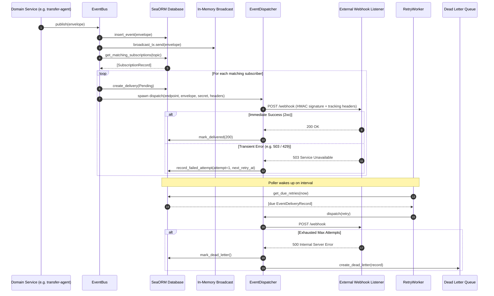

# Event Bus & External Webhook Dispatcher (`events`)

[](https://www.gnu.org/licenses/gpl-3.0)
[](https://www.rust-lang.org/)
[](#architecture-overview)

The **`events`** crate provides a resilient, high-throughput **hybrid Pub/Sub event bus** designed for both internal in-process messaging and reliable external webhook delivery within the DS-Protocol ecosystem.

It features **transactional outbox persistence**, sub-millisecond in-process broadcasting, **HMAC-SHA256 signature verification**, **exponential backoff with full jitter**, and a **Dead Letter Queue (DLQ)** with manual and batch re-drive capabilities.

---

## Table of Contents

- [Architecture Overview](#architecture-overview)
- [Component Layout](#component-layout)
- [Core Domain Abstractions](#core-domain-abstractions)
- [Integration Guide for Other Crates](#integration-guide-for-other-crates)
  - [1. Defining Domain Events (`IntoEvent`)](#1-defining-domain-events-intoevent)
  - [2. Publishing Events](#2-publishing-events)
  - [3. In-Memory Consumption (Internal Modules)](#3-in-memory-consumption-internal-modules)
  - [4. Registering External Webhook Listeners](#4-registering-external-webhook-listeners)
- [Reliability & Resilience Engine](#reliability--resilience-engine)
  - [Exponential Backoff with Full Jitter](#exponential-backoff-with-full-jitter)
  - [Failure Classification](#failure-classification)
  - [Dead Letter Queue (DLQ) & Re-Drive](#dead-letter-queue-dlq--re-drive)
- [Setup & Lifecycle Management](#setup--lifecycle-management)
- [REST API Reference](#rest-api-reference)
- [Testing Guide](#testing-guide)

---

## Architecture Overview

The event bus combines an immutable transactional event store with a dual-dispatch mechanism:

```mermaid
flowchart TB
    subgraph Producers ["Domain Producers (Crater Services)"]
        TAP[transfer-agent-ref]
        CAT[catalog-agent]
        NEG[negotiation-agent]
    end

    subgraph BusEngine ["EventBus Engine (crates/events)"]
        EB[EventBus]
        TXChannel["tokio::sync::broadcast<br/>(Buffer: 1024)"]
        Dispatcher[EventDispatcher<br/>HMAC-SHA256 Signer]
        Worker[RetryWorker<br/>Semaphore Concurrency]
    end

    subgraph Storage ["Persistent Storage (SeaORM / SQL)"]
        T_Events[("events<br/>(Immutable Outbox)")]
        T_Subs[("subscriptions<br/>(Topic Patterns)")]
        T_Deliv[("event_deliveries<br/>(Delivery Attempts)")]
        T_DLQ[("dead_letter_queue<br/>(Poison / Exhausted)")]
    end

    subgraph Consumers ["Consumers & Receivers"]
        WSGateway["Internal Consumers<br/>(BFF / WebSocket Stream)"]
        ExtWebhook1["External Partner Webhook 1<br/>(HMAC Verified)"]
        ExtWebhook2["External Partner Webhook 2<br/>(Custom Headers)"]
    end

    Producers -->|1. publish(envelope)| EB
    EB -->|2. insert_event| T_Events
    EB -->|3. broadcast.send| TXChannel
    TXChannel --> WSGateway

    EB -->|4. match subscriptions| T_Subs
    EB -->|5. create_delivery| T_Deliv
    EB -->|6. spawn immediate dispatch| Dispatcher

    Dispatcher -->|HTTP POST + X-Hub-Signature-256| ExtWebhook1
    Dispatcher -->|HTTP POST + Headers| ExtWebhook2

    Dispatcher -.->|Network Err / 5xx / 429| T_Deliv
    Worker -->|7. Poll due retries| T_Deliv
    Worker -->|8. Backoff retry| Dispatcher
    Worker -->|9. Exhausted / Non-retryable| T_DLQ

    T_DLQ -.->|10. Re-drive / Replay API| EB
```

### End-to-End Delivery Sequence



---

## Component Layout

```text
crates/events/
├── src/
│   ├── bus/
│   │   ├── dispatcher.rs        # HTTP client with HMAC-SHA256 signing & tracking headers
│   │   ├── envelope.rs          # Topic, TopicPattern, EventEnvelope
│   │   ├── error.rs             # EventBusError with Axum HTTP response mapping
│   │   ├── into_event.rs        # IntoEvent trait and impl_into_event! macro
│   │   ├── policy.rs            # RetryPolicy with exponential backoff & full jitter
│   │   ├── worker.rs            # RetryWorker with concurrency limit & graceful shutdown
│   │   └── mod.rs               # EventBus orchestrator and EventBusTrait
│   ├── data/
│   │   ├── entities/            # SeaORM schema entities (events, deliveries, dlq, subscriptions)
│   │   ├── migrations/          # SeaORM database migrations
│   │   └── repo/                # In-memory & SeaORM repository implementations
│   ├── http/                    # Axum REST endpoints (/events, /subscriptions, /dlq)
│   ├── setup/                   # Composition matching transfer-agent-ref (AppContext, Module, Workers)
│   └── lib.rs
└── tests/
    └── bus_tests.rs             # E2E integration test suite
```

---

## Core Domain Abstractions

### 1. `Topic`
A validated dot-separated identifier representing a business event type (e.g., `transfer.process.started`).
- Rejects wildcards, empty strings, and empty segments.
- Can be parsed with `Topic::new("...")` or `s.parse::<Topic>()`.

### 2. `TopicPattern`
Used by subscribers to match topics using hierarchical wildcards:
- `transfer.process.started`: Exact match only.
- `transfer.*.started`: Matches any single segment in place of `*`.
- `transfer.**`: Matches any topic starting with `transfer.` regardless of depth.
- `**`: Matches all events across the entire system.

### 3. `EventEnvelope`
An immutable, serializable packaging structure containing:
- `id: Urn`: Unique identifier in canonical URN format (`urn:uuid:<v4>`).
- `topic: Topic`: The event category.
- `source_crate: String`: Originating service (e.g., `"transfer-agent"`).
- `schema_version: u32`: Version number for payload schema evolution.
- `timestamp: DateTime<Utc>`: UTC creation timestamp.
- `correlation_id: Option<Urn>`: Distributed tracing correlation ID.
- `payload: serde_json::Value`: Arbitrary structured event body.

---

## Integration Guide for Other Crates

### 1. Defining Domain Events (`IntoEvent`)

In the domain crate where events originate (e.g., `crates/transfer-agent-ref`):

Add `events` to your `Cargo.toml`:
```toml
[dependencies]
events = { path = "../events" }
serde = { workspace = true }
```

Define your strongly-typed event struct and use the `impl_into_event!` macro:

```rust
use events::impl_into_event;
use serde::{Deserialize, Serialize};

#[derive(Debug, Clone, Serialize, Deserialize)]
pub struct TransferProcessStartedEvent {
    pub process_id: String,
    pub consumer_pid: String,
    pub provider_pid: String,
    pub agreement_id: String,
}

// Arguments: (Type, "static.topic.name", "source_crate", [optional schema_version])
impl_into_event!(
    TransferProcessStartedEvent,
    "transfer.process.started",
    "transfer-agent",
    1
);
```

#### Custom Correlation ID Implementation
If your domain model carries a correlation or transaction ID, implement `IntoEvent` manually:

```rust
use events::bus::envelope::{EventEnvelope, Topic};
use events::bus::into_event::IntoEvent;
use urn::Urn;

impl IntoEvent for TransferProcessStartedEvent {
    fn topic() -> Topic {
        Topic::new("transfer.process.started").expect("valid topic")
    }

    fn schema_version() -> u32 {
        1
    }

    fn correlation_id(&self) -> Option<Urn> {
        self.consumer_pid.parse::<Urn>().ok()
    }

    fn into_envelope(self) -> EventEnvelope {
        EventEnvelope::new(
            Self::topic(),
            "transfer-agent",
            Self::schema_version(),
            self.correlation_id(),
            serde_json::to_value(&self).expect("serializable event payload"),
        )
    }
}
```

---

### 2. Publishing Events

Inject `Arc<EventBus>` into your application context or service:

```rust
use std::sync::Arc;
use events::bus::{EventBus, EventBusTrait, IntoEvent};

pub struct TransferService {
    event_bus: Arc<EventBus>,
}

impl TransferService {
    pub async fn initiate_transfer(&self, process_id: String) -> Result<(), Box<dyn std::error::Error>> {
        let event = TransferProcessStartedEvent {
            process_id: process_id.clone(),
            consumer_pid: "urn:uuid:consumer-001".into(),
            provider_pid: "urn:uuid:provider-002".into(),
            agreement_id: "agreement-xyz".into(),
        };

        // Convert and publish into the event bus
        let envelope = event.into_envelope();
        let published = self.event_bus.publish(envelope).await?;

        tracing::info!(event_id = %published.id, "Domain event published successfully");
        Ok(())
    }
}
```

---

### 3. In-Memory Consumption (Internal Modules)

For services running in the same binary (such as WebSockets, BFF, or real-time event aggregation):

```rust
use std::sync::Arc;
use events::bus::EventBus;

pub fn start_internal_listener(event_bus: Arc<EventBus>) {
    let mut receiver = event_bus.subscribe();

    tokio::spawn(async move {
        while let Ok(envelope) = receiver.recv().await {
            tracing::debug!(
                topic = %envelope.topic,
                id = %envelope.id,
                "Internal bus received event"
            );

            if envelope.topic.as_str() == "transfer.process.started" {
                if let Ok(data) = serde_json::from_value::<TransferProcessStartedEvent>(envelope.payload) {
                    tracing::info!(process_id = %data.process_id, "Handling process start locally");
                }
            }
        }
    });
}
```

---

### 4. Registering External Webhook Listeners

External consumers receive HTTP POST notifications. Subscriptions can be configured via Rust code or through the REST API:

```rust
use std::collections::HashMap;
use events::data::repo::{CreateSubscriptionDto, EventSubscriptionRepo};

pub async fn register_partner_subscription(
    repo: Arc<dyn EventSubscriptionRepo>,
) -> Result<(), Box<dyn std::error::Error>> {
    let mut custom_headers = HashMap::new();
    custom_headers.insert("X-Tenant-Id".to_string(), "tenant-omega".to_string());

    let dto = CreateSubscriptionDto {
        callback_address: "https://partner-api.example.com/events".to_string(),
        topic_pattern: "transfer.**".to_string(), // Subscribes to all transfer events
        secret: Some("shared-hmac-secret-key-32-chars".to_string()),
        headers: Some(custom_headers),
        retry_limit: Some(5),
        expiration_time: None,
    };

    let subscription = repo.create_subscription(dto).await?;
    tracing::info!(id = %subscription.id, "Registered external webhook subscription");
    Ok(())
}
```

#### Headers Sent to External Webhooks
Every webhook dispatch includes standard tracing and security headers:
- `Content-Type: application/json`
- `X-Event-Id: urn:uuid:f47ac10b-58cc-4372-a567-0e02b2c3d479`
- `X-Event-Topic: transfer.process.started`
- `X-Event-Timestamp: 2026-09-06T10:15:30Z`
- `X-Correlation-Id: urn:uuid:...` *(if provided)*
- `X-Hub-Signature-256: sha256=a591a6d40bf420404a011733cfb7b190d62c65bf0bcda32b57b277d9ad9f146e` *(if secret configured)*
- Custom headers defined on the subscription.

---

## Reliability & Resilience Engine

### Exponential Backoff with Full Jitter

Deliveries are retried according to an exponential curve augmented with full random jitter to distribute retries evenly over time:

$$\text{base} = \min\left(\text{initial\_backoff} \times \text{multiplier}^{\text{attempt} - 1},\, \text{max\_backoff}\right)$$
$$\text{delay} = \max\left(\text{base} + \text{random}(-\text{jitter\_range},\, +\text{jitter\_range}),\, 0.1\text{s}\right)$$

```rust
use events::bus::policy::RetryPolicy;

let policy = RetryPolicy {
    max_attempts: 5,           // Up to 5 delivery attempts
    initial_backoff_secs: 2,   // First retry after ~2s
    max_backoff_secs: 3600,    // Cap retry delay at 1 hour
    multiplier: 2.0,           // 2s, 4s, 8s, 16s...
    jitter_factor: 0.2,        // ±20% randomized jitter
    timeout_secs: 10,          // HTTP request timeout
    poll_interval_secs: 5,     // Poller scan interval
};
```

### Failure Classification

The engine classifies errors to prevent wasting compute on unrecoverable requests:

| Scenario | Status Codes | Action |
|---|---|---|
| **Transient Errors** | `408 Request Timeout`, `429 Too Many Requests`, `500-599 Server Errors`, Network Timeouts | **Retry**: computes `next_retry_at` using backoff schedule. |
| **Permanent Errors** | `400 Bad Request`, `401 Unauthorized`, `403 Forbidden`, `404 Not Found` | **No Retry**: immediately moved to Dead Letter Queue (`DeadLetter`). |
| **Exhausted Retries** | Any status after `attempts >= retry_limit` | **Route to DLQ**: marks delivery `DeadLetter` and writes to `dead_letter_queue`. |

### Dead Letter Queue (DLQ) & Re-Drive

When deliveries fail permanently, they are safely parked in `dead_letter_queue` with their payload, last error, attempt count, and original timestamps.

```rust
// Replay a single failed dead letter (e.g. after fixing the external webhook endpoint)
let delivery = event_bus.replay_dead_letter("urn:uuid:dlq-id-123").await?;

// Replay all unresolved dead letters in bulk
let replayed_count = event_bus.replay_all_dead_letters().await?;
```

---

## Setup & Lifecycle Management

Modeled after `crates/transfer-agent-ref/src/setup`:

### 1. `AppContext` (`crates/events/src/setup/context.rs`)

```rust
use events::setup::AppContext;
use events::bus::policy::RetryPolicy;

// Production setup with SeaORM database
let db = vault.get_db_connection(config.common()).await?;
let ctx = AppContext::build(db, Some(RetryPolicy::default()));

// In-Memory setup for unit & integration testing
let test_ctx = AppContext::in_memory(None);
```

### 2. Background Retry Worker (`RetryWorkerHandle`)

```rust
// Spawn the background retrier
let worker_handle = ctx.spawn_retry_worker();

// When shutting down the application gracefully:
worker_handle.stop().await;
```

### 3. Module Composition (`EventsModule`)

[`EventsModule`](file:///Users/apabook/Desktop/ds-protocol/crates/events/src/setup/composition.rs) implements `common::module_loader::service_module::ServiceModuleTrait`:

```rust
use std::sync::Arc;
use events::setup::{AppContext, EventsModule};

let events_module = EventsModule::new(Arc::new(ctx));

// ServiceModuleTrait exports:
// - name(): "events"
// - migrations(): SeaORM database migrations
// - http(): Mounts "/api/v1/events"
```

---

## REST API Reference

All routes are mounted under the service base path (e.g., `/api/v1/events`):

### Events Management (`/events`)

| Method | Route | Description | Response Status |
|---|---|---|---|
| `POST` | `/publish` | Publish an event envelope into the bus | `201 Created` |
| `GET` | `/` | List published events (`?topic=...&limit=50&offset=0`) | `200 OK` |
| `GET` | `/{id}` | Get event by URN or UUID | `200 OK` / `404 Not Found` |
| `GET` | `/{id}/deliveries` | List all webhook delivery records for an event | `200 OK` |

#### Example Publish Request
```http
POST /api/v1/events/events/publish
Content-Type: application/json

{
  "topic": "transfer.process.completed",
  "source_crate": "dataplane",
  "schema_version": 1,
  "correlation_id": "urn:uuid:7c9e6679-7425-40de-944b-e07fc1f90ae7",
  "payload": {
    "process_id": "tp-500",
    "status": "COMPLETED",
    "bytes_transferred": 1048576
  }
}
```

### Subscriptions Management (`/subscriptions`)

| Method | Route | Description | Response Status |
|---|---|---|---|
| `POST` | `/` | Create a webhook subscription (`CreateSubscriptionDto`) | `201 Created` |
| `GET` | `/` | List all registered subscriptions | `200 OK` |
| `GET` | `/{id}` | Get subscription details by ID | `200 OK` / `404 Not Found` |
| `PUT` | `/{id}` | Update subscription pattern, secret, headers, or status | `200 OK` |
| `DELETE`| `/{id}` | Deactivate and delete subscription | `204 No Content` |

### Dead Letter Queue (`/dlq`)

| Method | Route | Description | Response Status |
|---|---|---|---|
| `GET` | `/` | List dead letters (`?status=Unresolved&limit=50&offset=0`) | `200 OK` |
| `GET` | `/{id}` | Get dead letter details by ID | `200 OK` / `404 Not Found` |
| `POST` | `/{id}/replay` | Immediately re-attempt delivery of a dead letter | `200 OK` |
| `POST` | `/replay-all` | Re-attempt delivery for all unresolved dead letters | `200 OK` (`{"replayed_count": n}`) |
| `DELETE`| `/{id}` | Purge dead letter entry permanently | `204 No Content` |

---

## Testing Guide

The crate provides zero-database in-memory implementations (`InMemoryEventBusRepo`) enabling fast, deterministic unit and integration tests:

```rust
#[tokio::test]
async fn test_domain_event_flow() {
    let ctx = events::setup::AppContext::in_memory(None);
    let mut rx = ctx.event_bus.subscribe();

    let event = TransferProcessStartedEvent {
        process_id: "proc-1".into(),
        consumer_pid: "urn:uuid:c1".into(),
        provider_pid: "urn:uuid:p1".into(),
        agreement_id: "a1".into(),
    };

    ctx.event_bus.publish(event.into_envelope()).await.unwrap();

    let received = rx.recv().await.unwrap();
    assert_eq!(received.topic.as_str(), "transfer.process.started");
}
```

Run the complete test suite:
```bash
cargo test -p events
```
