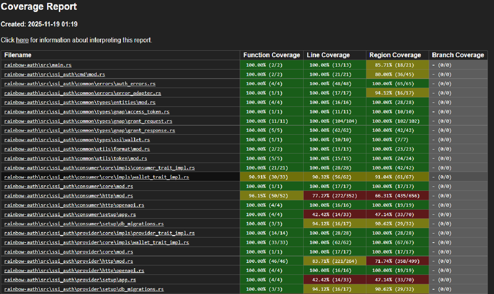

# PT 4300 Aumento de cobertura de tests

## Table of Contents

- [Overview](#overview)
- [Project Structure](#project-structure)
- [Realization](#realization)
- [Tools](#tools)
- [Resumen](#resumen)
- [Results](#results)

## Overview

Implementación de los tests unitarios que aseguren la cobertura sobre el código fuente.

## Project Structure

```text
rainbow-auth/
├── .scannerwork/                # Configuración y análisis estático (ej. SonarQube)
├── src/                         # Código fuente principal
├── test-data/                   # Datos de prueba (fixtures, mocks)
└── tests/                       # Carpeta de pruebas automatizadas
    ├── test_cmd.rs
    ├── test_common_errors.rs
    ├── test_common_types_entities.rs
    ├── test_common_types_gnap_grant_request.rs
    ├── test_common_types_gnap_grant_response.rs
    ├── test_common_utils.rs
    ├── test_consumer_core_impl_wallet_trait_impl.rs
    ├── test_consumer_core_impls_consumer_trait.rs
    ├── test_consumer_core_mod.rs
    ├── test_consumer_http_mod.rs
    ├── test_consumer_http_openapi.rs
    ├── test_consumer_setup_app.rs
    ├── test_consumer_setup_db_migrations.rs
    ├── test_provider_core_impl_provider_trait_impl.rs
    ├── test_provider_core_mod.rs
    ├── test_provider_http_mod.rs
    ├── test_provider_http_openapi.rs
    ├── test_provider_setup_app.rs
    └── test_provider_setup_db_migrations.rs
```

### Descripción de los archivos de tests

| Archivo | Descripción |
|---------|-------------|
| **test_cmd.rs** | Pruebas relacionadas con la ejecución de comandos del sistema. |
| **test_common_errors.rs** | Valida el manejo y propagación de errores comunes en la aplicación. |
| **test_common_types_entities.rs** | Comprueba la correcta definición y uso de entidades comunes. |
| **test_common_types_gnap_grant_request.rs** | Pruebas para solicitudes GNAP (Grant Request). |
| **test_common_types_gnap_grant_response.rs** | Valida respuestas GNAP (Grant Response). |
| **test_common_utils.rs** | Tests para utilidades compartidas. |
| **test_consumer_core_impl_wallet_trait_impl.rs** | Verifica la implementación del trait `Wallet` en el núcleo del consumidor. |
| **test_consumer_core_impls_consumer_trait.rs** | Pruebas para la implementación del trait `Consumer`. |
| **test_consumer_core_mod.rs** | Tests del módulo principal del consumidor. |
| **test_consumer_http_mod.rs** | Valida la capa HTTP del consumidor. |
| **test_consumer_http_openapi.rs** | Comprueba la integración OpenAPI para consumidor. |
| **test_consumer_setup_app.rs** | Tests para la configuración inicial de la aplicación del consumidor. |
| **test_consumer_setup_db_migrations.rs** | Valida migraciones de base de datos para consumidor. |
| **test_provider_core_impl_provider_trait_impl.rs** | Verifica la implementación del trait `Provider`. |
| **test_provider_core_mod.rs** | Tests del módulo principal del proveedor. |
| **test_provider_http_mod.rs** | Valida la capa HTTP del proveedor. |
| **test_provider_http_openapi.rs** | Comprueba la integración OpenAPI para proveedor. |
| **test_provider_setup_app.rs** | Tests para la configuración inicial de la aplicación del proveedor. |
| **test_provider_setup_db_migrations.rs** | Valida migraciones de base de datos para proveedor. |


## Realization

Para garantizar una cobertura completa y confiable, la implementación de los tests se ha realizado siguiendo buenas prácticas de desarrollo y pruebas en Rust:

### Diseño de pruebas unitarias e integración

Cada prueba se centra en validar una única funcionalidad o comportamiento específico, asegurando independencia entre casos.
Se han creado pruebas tanto unitarias como de integración para cubrir módulos críticos (núcleo, capa HTTP, migraciones, etc.).

### Uso de mocks y stubs

Se han mockeado dependencias externas y componentes complejos (por ejemplo, acceso a base de datos, servicios HTTP) para aislar la lógica interna.
Esto permite simular escenarios controlados y reproducibles, reduciendo la dependencia de entornos externos.

### Pruebas de funciones asíncronas

Para funciones basadas en async/await, se utiliza el runtime Tokio, que proporciona:

- Un event loop eficiente para ejecutar tareas concurrentes.
- Soporte para operaciones I/O no bloqueantes.

Las pruebas asíncronas se ejecutan mediante el atributo #[tokio::test], garantizando que cada test disponga de su propio contexto de ejecución.

### Estrategia de cobertura

Se han identificado puntos críticos del código (traits, módulos principales, lógica de negocio) y se han diseñado pruebas específicas para cada uno.
Se priorizó la cobertura de:

- Flujos principales (registro, autenticación, migraciones).
- Manejo de errores y validaciones.
- Integración con OpenAPI y capa HTTP.

## Tools

Tokio en Rust es un runtime asíncrono diseñado para ejecutar código basado en el modelo async/await. Es uno de los componentes más importantes para desarrollar aplicaciones concurrentes y de alto rendimiento en Rust, especialmente en entornos de red.
Este runtime:
- Proporciona un event loop eficiente para manejar tareas asíncronas.
- Implementa un scheduler que ejecuta múltiples tareas en paralelo usando hilos.
- Ofrece primitivas de I/O asíncrono (TCP, UDP, HTTP, etc.) sin bloquear el hilo principal.
- Incluye timers, canales, y utilidades para sincronización.

Tokio es fundamental para pruebas que involucran operaciones de red, concurrencia o servicios que requieren alta escalabilidad.

Para la ejecución de los tests utilizamos Cargo, la herramienta oficial de gestión de proyectos y dependencias en Rust.
Cargo ofrece:
- Compilación y ejecución del código fuente y pruebas.
- Gestión de dependencias integrada con el compilador de Rust.
- Comandos simples para construir, probar y documentar proyectos.

Es comparable a herramientas como npm en JavaScript o pip en Python, pero está mucho más integrada con

Para usar esta herramienta y lanzar todos los test de proyecto se usará en la terminal el comando:

```bash
cargo test
```

Si quisieramos lanzar solo los test de un paquete en concreto del proyecto usaremos:

```bash
cargo test -p nombre_del_paquete
(ej. cargo test -p rainbow-auth)
```

Y si queremos lanzar un test en concreto usaremos:

```bash
cargo test -p nombre_del_paquete nombre_del_test
(ej. cargo test -p rainbow-auth test_wallet_register_success)
```

Para generar un informe que muestre la cobertura, usaremos la herramienta “LLVM”. Esta es una herramienta para proyectos Rust que permite medir la cobertura de código usando “LLVM”. Está construida sobre Cargo y utiliza la infraestructura de LLVM para generar informes detallados.
“LLVM”, nos permite:

- Ejecutar los test y calcular qué porcentaje del código fue cubierto.
- Genera informes en varios formatos: texto, HTML, JSON.
- Se integra fácilmente con cargo, por lo que no necesitas configuraciones complejas.

Las ventajas de usar esta herramienta son:

- Usa LLVM source-based code coverage, que es más preciso que métodos tradicionales.
- Compatible con unit tests, integration tests y doctests.

El informe generado se guadara en la ruta: rainbow\target\llvm-cov\html\

Para usar “LLVM”, tendremos previamente (sino lo hemos hecho ya), que instalar la herramienta, con el comando:

```bash
cargo install cargo-llvm-cov
```

Para generar y abrir el informe completo del proyecto, ejecutaremos el comando:

```bash
cargo llvm-cov --open
```

Si se quiere generar el informe de un paquete en concreto del proyecto usaremos:

```bash
cargo llvm-cov --open -p nombre_del_paquete
(ej. cargo llvm-cov --open -p rainbow_auth)
```

## Resumen

Para ejecutar todos los test del proyecto usaremos el comando:

```bash
cargo test
```

Para obtener un informe de cobertura de los test usaremos:

```bash
cargo llvm-cov --open
```

## Results

Resultados obtenidos tras haber ejecutado “LLVM”:

